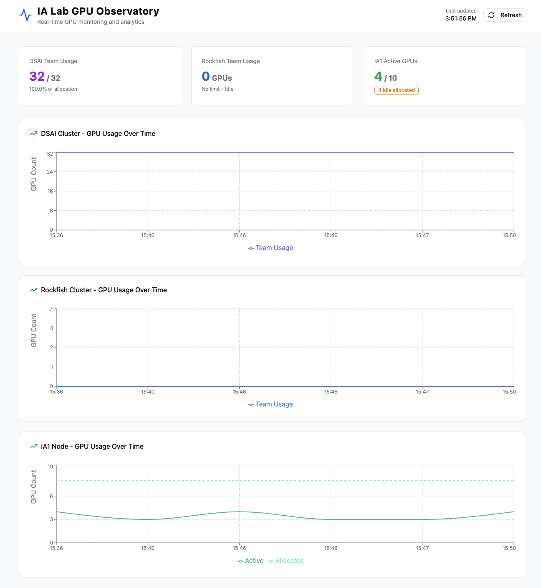
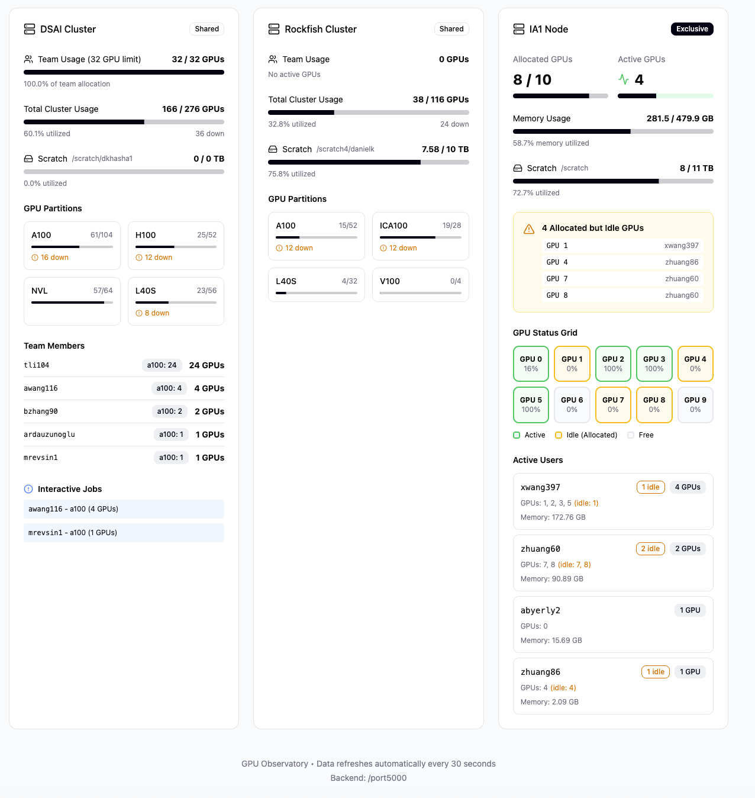

# GPU Stats Dashboard

Real-time GPU monitoring for DSAI, Rockfish, and IA1 servers. A FastAPI backend runs the collector scripts via SSH and exposes a REST API; a React/Vite frontend displays the data.




## Requirements

- Python 3.9+
- Node.js 18+
- SSH access configured for `dsai`, `rockfish`, and `ia1` hosts

## Setup

### Backend

```bash
# Install Python dependencies (using uv)
uv sync

# Or with pip
pip install fastapi uvicorn
```

### Frontend

```bash
cd frontend
npm install
```

## Running

### Production (single command)

```bash
./run.sh
```

Builds the frontend (skipped if `frontend/dist/` already exists) and serves everything on **http://localhost:5000**. Pass `--rebuild` to force a fresh frontend build.

### Development (hot reload)

Open two terminals.

**Terminal 1 — backend** (port 8000):
```bash
uvicorn app:app --reload --port 8000
```

**Terminal 2 — frontend** (port 5173):
```bash
cd frontend
npm run dev
```

Open http://localhost:5173 in your browser.

## API Endpoints

| Method | Path | Description |
|--------|------|-------------|
| `GET` | `/stats` | All servers combined |
| `GET` | `/stats/dsai` | DSAI stats |
| `GET` | `/stats/rockfish` | Rockfish stats |
| `GET` | `/stats/ia1` | IA1 stats |
| `POST` | `/stats/refresh` | Force-refresh all servers |
| `POST` | `/stats/{server}/refresh` | Force-refresh one server |

Stats are cached for 15 minutes. The backend refreshes all servers on startup and every 15 minutes in the background.

## Project Structure

```
gpu-stats-ia1-lab/
  app.py                  # FastAPI backend
  pyproject.toml          # Python dependencies
  danielgpus_dsai.py      # DSAI collector script
  danielgpus_rockfish.py  # Rockfish collector script
  danielgpus_ia1.py       # IA1 collector script
  frontend/               # React/Vite frontend
    src/app/App.tsx
    src/app/components/
    src/app/types/
```
